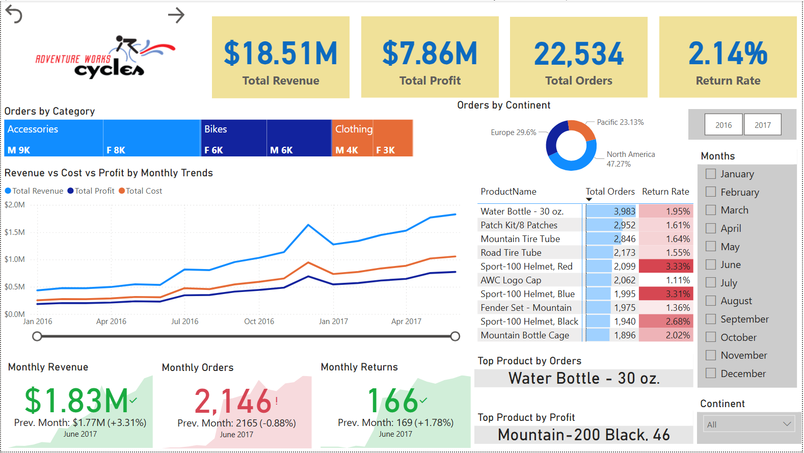
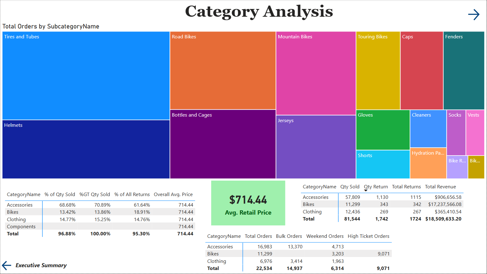
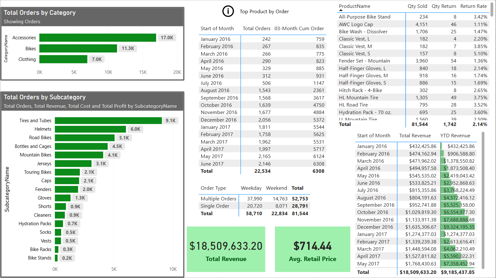
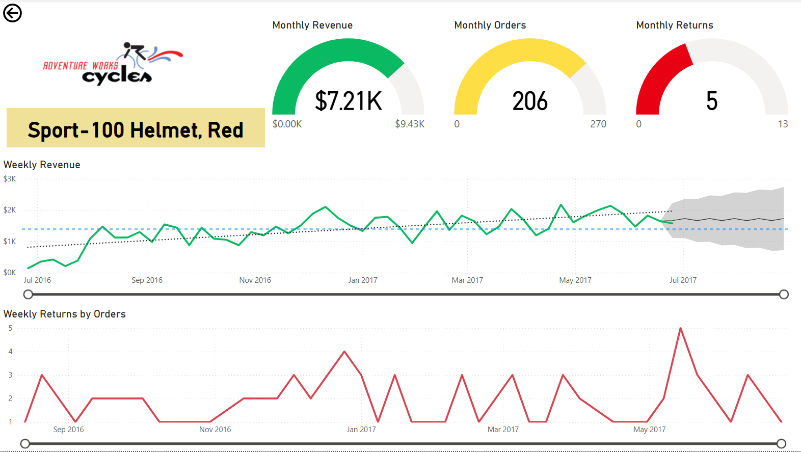
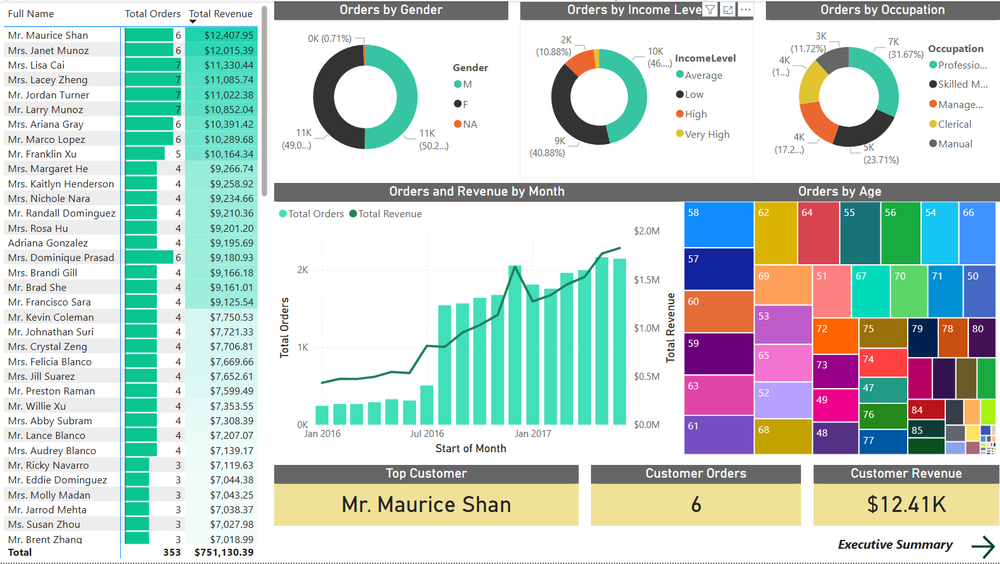
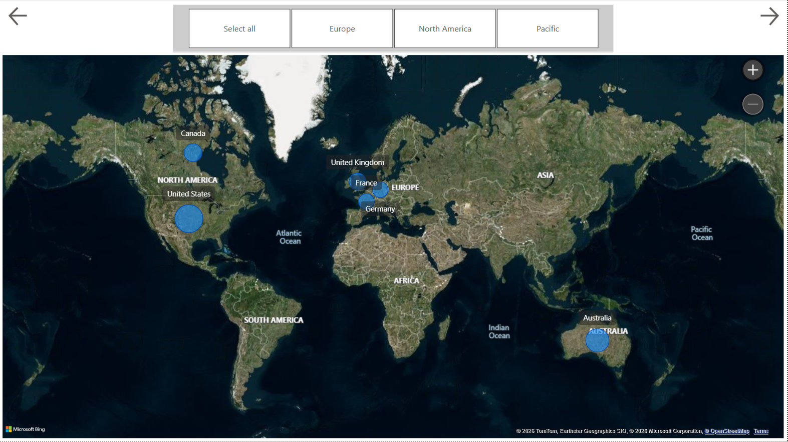

# 📊 Adventure Works Sales Dashboard — Power BI

A multi-page interactive sales dashboard built in **Power BI** using the Adventure Works dataset.  
Developed as part of my Power BI training to demonstrate real-world data analysis and visualization skills.

---

## 🗂️ Dashboard Pages

| # | Page | Description |
|---|---|---|
| 1 | **Executive Summary** | High-level KPIs — Revenue, Orders, Profit, Return Rate |
| 2 | **Category Analysis** | Orders & Revenue breakdown by Product Category |
| 3 | **Orders Overview** | Monthly trends, order types, cumulative orders & revenue |
| 4 | **Product Details** | Product-level performance — Sales, Returns, Targets |
| 5 | **Customer Details** | Customer segmentation, top customers, revenue per customer |
| 6 | **Map** | Geographic sales distribution across regions |
| 7 | **Sales Decomposition Tree** | Deep-dive analysis by Category, Subcategory & Country |

---

## 🖼️ Screenshots

### Executive Summary

### Category Analysis

### Orders Overview

### Product Details

### Customer Details

### Map

### Sales Decomposition Tree

---

## 🛠️ Tools & Skills Used

- **Power BI Desktop**
- **DAX** — Measures, KPIs, Time Intelligence
- **Data Modeling** — Relationships across multiple tables
- **Visualizations** — Bar charts, Line charts, Treemap, Map, Decomposition Tree, Matrices, KPI Cards
- **Navigation Buttons** between pages

---

## 🎓 About

- 📚 Built during **DigiSkills Power BI Course**
- 🎓 Student at **Virtual University of Pakistan**
- 📍 Karachi, Pakistan

---

## 📫 Connect with Me

- 💼 [LinkedIn](www.linkedin.com/in/ushnanaeem)
- 🐙 [GitHub](https://github.com/Ushna-hub)
